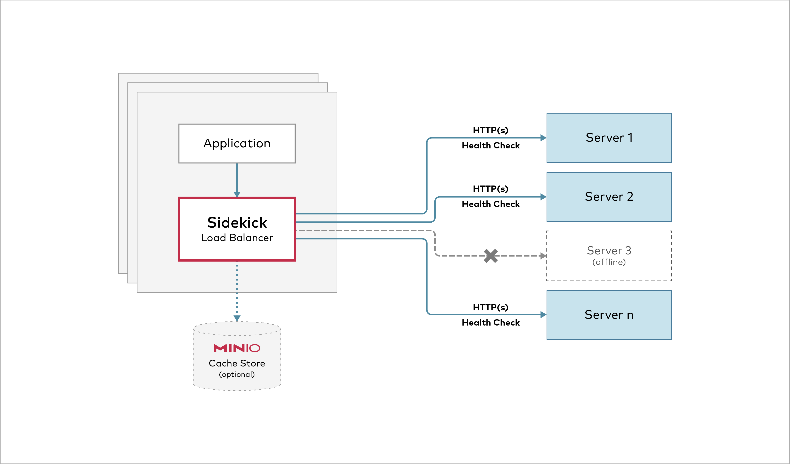

*sidekick* is a high-performance sidecar load-balancer. By attaching a tiny load balancer as a sidecar to each of the client application processes, you can eliminate the centralized loadbalancer bottleneck and DNS failover management. *sidekick* automatically avoids sending traffic to the failed servers by checking their health via the readiness API and HTTP error returns.

**Table of Contents**

- [Download](#download)
- [Usage](#usage)
    - [Examples](#examples)
    - [Realworld Example with spark-orchestrator](#realworld-example-with-spark-orchestrator)
        - [Configure *spark-orchestrator*](#configure-spark-orchestrator)
        - [Install *MinIO*](#install-minio)
        - [Run the spark job](#run-the-spark-job)
    - [Roadmap](#roadmap)

# Download
[Download Binary Releases](https://github.com/minio/sidekick/releases) for various platforms.

# Architecture


# Usage

```
USAGE:
  sidekick [FLAGS] ENDPOINTs...
  sidekick [FLAGS] ENDPOINT{1...N}

FLAGS:
  --address value, -a value          listening address for sidekick (default: ":8080")
  --health-path value, -p value      health check path
  --health-duration value, -d value  health check duration in seconds (default: 5)
  --insecure, -i                     disable TLS certificate verification
  --log , -l                         enable logging
  --trace, -t                        enable HTTP tracing
  --quiet                            disable console messages
  --json                             output sidekick logs and trace in json format
  --debug                            output verbose trace
  --help, -h                         show help
  --version, -v                      print the version
```

## Examples

- Load balance across a web service using DNS provided IPs.
```
$ sidekick --health-path=/ready http://myapp.myorg.dom
```

- Load balance across 4 MinIO Servers (http://minio1:9000 to http://minio4:9000)
```
$ sidekick --health-path=/minio/health/ready --address :8000 http://minio{1...4}:9000
```

- Load balance across 16 MinIO Servers (http://minio1:9000 to http://minio16:9000)
```
$ sidekick --health-path=/minio/health/ready http://minio{1...16}:9000
```

## Realworld Example with spark-orchestrator

As spark *driver*, *executor* sidecars, to begin with install spark-operator and MinIO on your kubernetes cluster

**optional** create a kubernetes namespace `spark-operator`
```
kubectl create ns spark-operator
```

### Configure *spark-orchestrator*

We shall be using maintained spark operator by GCP at https://github.com/GoogleCloudPlatform/spark-on-k8s-operator

```
helm repo add incubator http://storage.googleapis.com/kubernetes-charts-incubator
helm install spark-operator incubator/sparkoperator --namespace spark-operator  --set sparkJobNamespace=spark-operator --set enableWebhook=true
```

### Install *MinIO*
```
helm install minio-distributed stable/minio --namespace spark-operator --set accessKey=minio,secretKey=minio123,persistence.enabled=false,mode=distributed
```

> NOTE: persistence is disabled here for testing, make sure you are using persistence with PVs for production workload.
> For more details read our helm [documentation](https://github.com/helm/charts/tree/master/stable/minio)

Once minio-distributed is up and running configure `mc` and upload some data, we shall choose `mybucket` as our bucketname.

Port-forward to access minio-cluster locally.
```
kubectl port-forward pod/minio-distributed-0 9000
```

Create bucket named `mybucket` and upload some text data for spark word count sample.
```
mc config host add minio-distributed http://localhost:9000 minio minio123
mc mb minio-distributed/mybucket
mc cp /etc/hosts minio-distributed/mybucket/mydata/{1..4}.txt
```

### Run the spark job

```yml
apiVersion: "sparkoperator.k8s.io/v1beta2"
kind: SparkApplication
metadata:
  name: spark-minio-app
  namespace: spark-operator
spec:
  sparkConf:
    spark.kubernetes.allocation.batch.size: "50"
  hadoopConf:
    "fs.s3a.endpoint": "http://127.0.0.1:9000"
    "fs.s3a.access.key": "minio"
    "fs.s3a.secret.key": "minio123"
    "fs.s3a.path.style.access": "true"
    "fs.s3a.impl": "org.apache.hadoop.fs.s3a.S3AFileSystem"
  type: Scala
  sparkVersion: 2.4.5
  mode: cluster
  image: minio/spark:v2.4.5-hadoop-3.1
  imagePullPolicy: Always
  restartPolicy:
      type: OnFailure
      onFailureRetries: 3
      onFailureRetryInterval: 10
      onSubmissionFailureRetries: 5
      onSubmissionFailureRetryInterval: 20

  mainClass: org.apache.spark.examples.JavaWordCount
  mainApplicationFile: "local:///opt/spark/examples/target/original-spark-examples_2.11-2.4.6-SNAPSHOT.jar"
  arguments:
  - "s3a://mytestbucket/mydata"
  driver:
    cores: 1
    coreLimit: "1000m"
    memory: "512m"
    labels:
      version: 2.4.5
    sidecars:
    - name: minio-lb
      image: "minio/sidekick:v0.1.4"
      imagePullPolicy: Always
      args: ["--health-path", "/minio/health/ready", "--address", ":9000", "http://minio-distributed-{0...3}.minio-distributed-svc.spark-operator.svc.cluster.local:9000"]
      ports:
        - containerPort: 9000

  executor:
    cores: 1
    instances: 4
    memory: "512m"
    labels:
      version: 2.4.5
    sidecars:
    - name: minio-lb
      image: "minio/sidekick:v0.1.4"
      imagePullPolicy: Always
      args: ["--health-path", "/minio/health/ready", "--address", ":9000", "http://minio-distributed-{0...3}.minio-distributed-svc.spark-operator.svc.cluster.local:9000"]
      ports:
        - containerPort: 9000
```

```
kubectl create -f spark-job.yaml
kubectl logs -f --namespace spark-operator spark-minio-app-driver spark-kubernetes-driver
```

### S3 Cache
S3 compatible object store can be configured for shared cache storage

Caching can be enabled by setting the cache environment variables for sidekick which specify
the endpoint of S3 compatible object store, access key, secret key to authenticate to the store.
Objects are cached on GET to the shared store if object from the backend exceeds a configurable
minimum size.
```bash
export SIDEKICK_CACHE_ENDPOINT="https://minio:9080"
export SIDEKICK_CACHE_ACCESS_KEY="minio"
export SIDEKICK_CACHE_SECRET_KEY="minio123"
export SIDEKICK_CACHE_BUCKET="cache01"
export SIDEKICK_CACHE_MIN_SIZE=64MB
export SIDEKICK_CACHE_HEALTH_DURATION=20
$ sidekick --health-path=/ready http://myapp.myorg.dom
```


